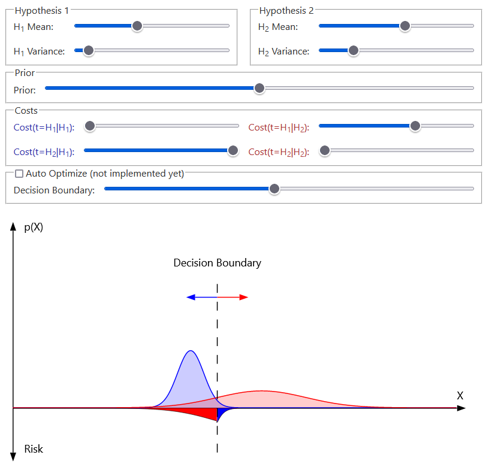

[Live Demo](https://static.laszlokorte.de/hypothesis/) | [Short demo video](https://www.youtube.com/watch?v=YDMagPuzIp4)

# Binary Hypothesis Test

The goal is to decide if a given sample x is more likely to originate from one distribution (hypothesis 1) or from another one (hypthesis 2).

It is assumed that both possible distributions are known and that we know the prior probability of any sample to be from the one or the other distribution. For example if the prior is 0.5 in general both distributions are equally likely. If the prior is 0.1 samples from one distribution are assumed to be much more likely than from the other.
