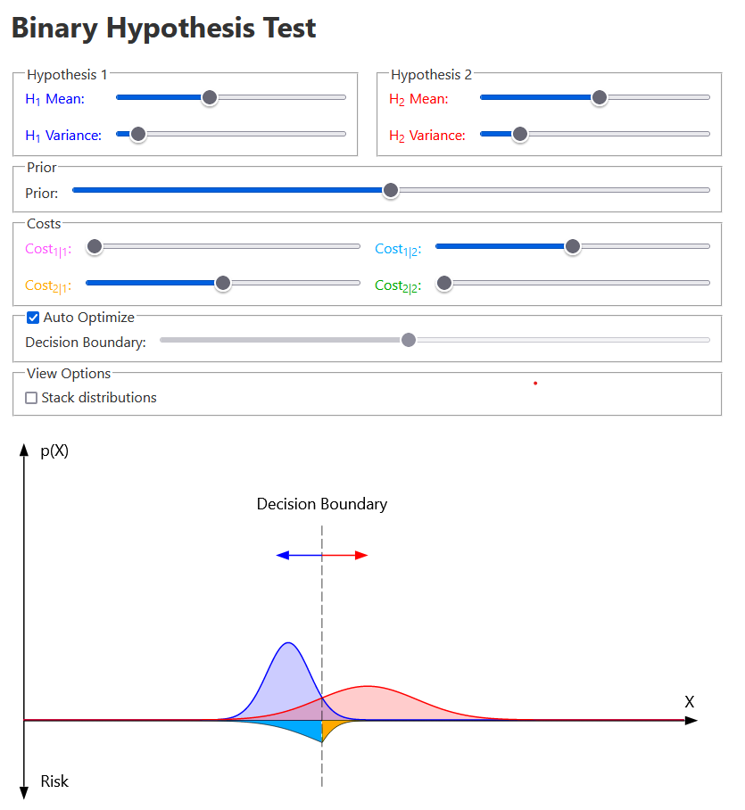

[Live Demo](https://static.laszlokorte.de/hypothesis/)

# Binary Hypothesis Test

The goal is do decide if a given sample x is more likely to originate from one distribution (hypothesis 1) or from another one (hypthesis 2).

It is assumed that both possible distributions are known and that we know the prior probability of any sample to be from the one or the other distribution. For example if the prior is 0.5 in general both distributions are equally likely. If the prior is 0.1 samples from one distribution are assumed to be much more likely than from the other.

There exist 4 possible outcomes:

* H1 is true and H1 is detected
* H1 is true but H2 is detected
* H2 is true but H1 is detected
* H2 is true and H2 is detected

Each case has an associated cost. Case 1 and case 4 typacally have a cost of 0 because they are desired. The other two cases represent false positive and false negative results. Their cost is assigned individually.

The goal is to find a decision boundary that devides the sample space into two regions that classify all samples and minimize the expected total cost (risk).